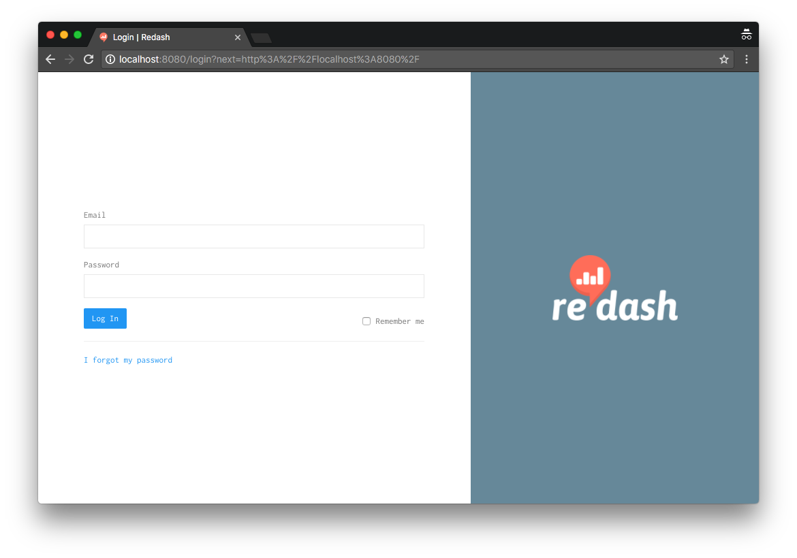
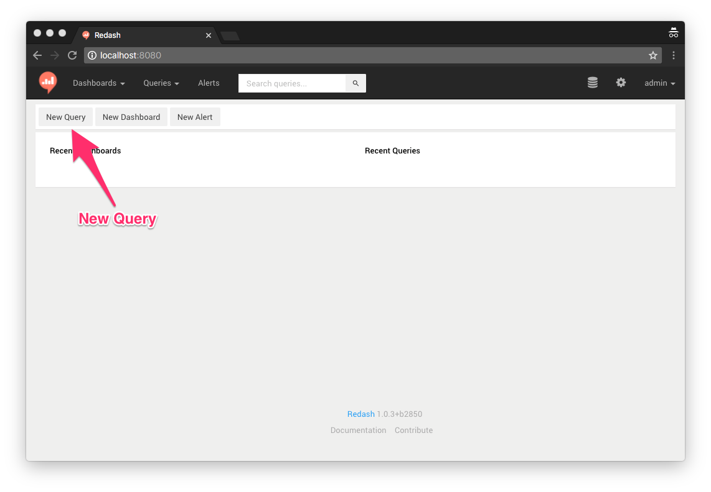
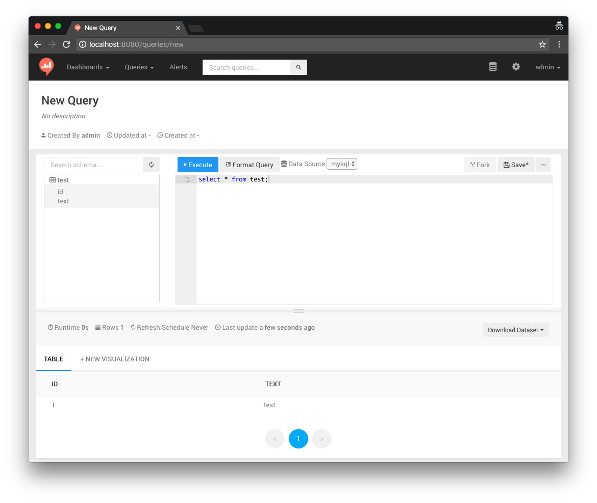

# Docker-redash

## Mysql + Redash on Docker

### 準備

* docker ( >= 1.12 ) がセットアップされていること
  * docker コマンドが使える状態に
* MySQL CLI Client がインストールされていること
  * mysql コマンドが使える状態に
* 次のコマンドで必要なものを準備します
  * 動作は `-n` オプションを付けて確認出来るので気になる方は試してみて下さい
      * docker-compose の取得
      * redash で使用する postgres のセットアップ
* vagrant を使う場合は root ユーザに変更する必要があります

```
$ make install setup
```

### 動かし方

Redash にアクセスする際の `PORT` 番号は自分の環境でバインド可能なものを指定すること。

```
$ make up PORT=8080
```

ターミナルをもう一つ開いてコンテナの状態を確認します。
```
$ docker ps
CONTAINER ID        IMAGE                   COMMAND                  CREATED             STATUS                      PORTS                           NAMES
a3d80e74b9c4        redash/nginx:latest     "nginx -g 'daemon of…"   35 minutes ago      Up 37 minutes               443/tcp, 0.0.0.0:8080->80/tcp   nginx
986fcd970446        redash/redash:latest    "/app/bin/docker-ent…"   35 minutes ago      Up 37 minutes               5000/tcp                        worker
4c457a8abcf9        redash/redash:latest    "/app/bin/docker-ent…"   35 minutes ago      Up 37 minutes (healthy)     5000/tcp                        redash
6ec65873f036        mysql:8.0               "docker-entrypoint.s…"   36 minutes ago      Up 37 minutes (healthy)   0.0.0.0:3306->3306/tcp          mysql
8d9e54a8ed8f        redis:3.0-alpine        "docker-entrypoint.s…"   36 minutes ago      Up 37 minutes (healthy)     6379/tcp                        redis
c583a61221d3        postgres:9.5.6-alpine   "docker-entrypoint.s…"   36 minutes ago      Up 37 minutes (healthy)     5432/tcp                        postgres
```

止める時は次のコマンドです。

```
$ make stop
Stopping nginx ... done
Stopping worker ... done
Stopping redash ... done
Stopping mysql ... done
Stopping redis ... done
Stopping postgres ... done
```

### 動作確認

次の URL にアクセスします（PORT 番号は適宜変更すること）。

[http://localhost:8080/](http://localhost:8080/)

以下のログイン情報を入力してログインします。

* Email: `admin@example.com`
* Password: `redash`





ログイン後、以下の画面が表示されるので、`New Query` を押してクエリを書いてみましょう。




その前に、データがないので MySQL CLI Client で MySQL Server に接続してテーブルを作成してデータを入れてみましょう。

* User: `redash`
* Password: `redash`

```
$ mysql -h127.0.0.1 -P3306 -uredash -p redash
Enter password:
Welcome to the MySQL monitor.  Commands end with ; or \g.
Your MySQL connection id is 11
Server version: 8.0.11 MySQL Community Server - GPL

Copyright (c) 2000, 2018, Oracle and/or its affiliates. All rights reserved.

Oracle is a registered trademark of Oracle Corporation and/or its
affiliates. Other names may be trademarks of their respective
owners.

Type 'help;' or '\h' for help. Type '\c' to clear the current input statement.

mysql> CREATE TABLE `test` (
    ->   `id` INT AUTO_INCREMENT,
    ->   `text` VARCHAR(256),
    ->   PRIMARY KEY (`id`)
    -> );
Query OK, 0 rows affected (0.07 sec)

mysql> DESC test;
+-------+--------------+------+-----+---------+----------------+
| Field | Type         | Null | Key | Default | Extra          |
+-------+--------------+------+-----+---------+----------------+
| id    | int(11)      | NO   | PRI | NULL    | auto_increment |
| text  | varchar(256) | YES  |     | NULL    |                |
+-------+--------------+------+-----+---------+----------------+
2 rows in set (0.09 sec)

mysql> INSERT INTO `test` (`text`) VALUES ('test');
Query OK, 1 row affected (0.00 sec)

mysql> select * from test;
+----+---------------+
| id | text          |
+----+---------------+
|  1 | test          |
+----+---------------+
1 row in set (0.01 sec)
```

データの準備ができたので、redash からクエリを投げてみましょう。無事結果が表示されたら動作確認は完了です。




色々触ってみて困った時は、次のコマンドで環境を reset 出来ます（起動後に設定した Redash の設定や、MySQL のデータが初期化されます）。

```
$ make reset up
```


## その他

### コンテナでコマンドを実行する

2つの方法があります。

例えば mysql container で動いているプロセスを見たい場合、


その1

```
$ make debug/mysql
root@6a897d20ed22:/# ps aux
USER       PID %CPU %MEM    VSZ   RSS TTY      STAT START   TIME COMMAND
mysql        1  0.0  9.8 1270724 200952 ?      Ssl  11:42   0:01 mysqld
root      2658  0.1  0.1  20252  3036 pts/0    Ss   12:42   0:00 bash
root      2670  0.0  0.1  17504  2068 pts/0    R+   12:42   0:00 ps aux
```

その2（その1 では container に入るために bash が実行されています）

```
$ make exec/mysql COMMAND="ps aux"
USER       PID %CPU %MEM    VSZ   RSS TTY      STAT START   TIME COMMAND
mysql        1  0.0  9.8 1270724 200952 ?      Ssl  11:42   0:01 mysqld
root      2709  0.0  0.1  17504  2116 pts/0    Rs+  12:43   0:00 ps aux
```

### カスタム

実行時に環境変数を通してパラメータを渡すことが出来ます。

詳しくは Makefile を見て下さい。

※ `REDASH_CONTAINER_NAME` のみ **redash** で固定です（これは redash/nginx の nginx の設定ファイルを見れば分かります）

```
$ grep -E "^[A-Z]+.*" Makefile | sed -e 's/[^A-Z] *://g' | column -t -s "="
NGINX_VERSION                       latest
MYSQL_VERSION                       8.0
REDASH_VERSION                      latest
NGINX_CONTAINER_NAME                nginx
MYSQL_CONTAINER_NAME                mysql
POSTGRES_CONTAINER_NAME             postgres
REDASH_CONTAINER_NAME               redash
REDASH_WORKER_CONTAINER_NAME        worker
REDIS_CONTAINER_NAME                redis
MYSQL_PORT                          3306
PORT                                8080
MYSQL_ROOT_PASSWORD                 redash
MYSQL_DATABASE                      redash
MYSQL_USER                          redash
MYSQL_PASSWORD                      redash
REDASH_ADMIN_PASSWORD               redash
REDASH_ORG_NAME                     treasure
REDASH_COOKIE_SECRET                treasure
REDASH_WOKERS_COUNT                 2
BIN_DIR                             $(shell pwd)/bin
DOCKER_COMPOSE_YAML                 docker-compose.yml
DOCKER_CMD                          $(shell which docker)
DOCKER_COMPOSE                      $(shell pwd)/bin/docker-compose
DOCKER_COMPOSE_CMD                  $(DOCKER_COMPOSE) -f $(DOCKER_COMPOSE_YAML)
DOCKER_COMPOSE_VERSION              1.14.0
NO_OPTION_COMMANDS                  pull stop restart
DOCKER_COMPOSE_NO_OPTION_COMMANDS   $(addprefix docker/,$(NO_OPTION_COMMANDS))
COMMAND                             ls -l
TARGET
```
